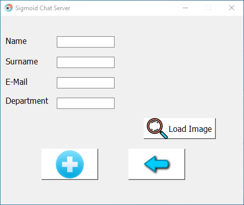
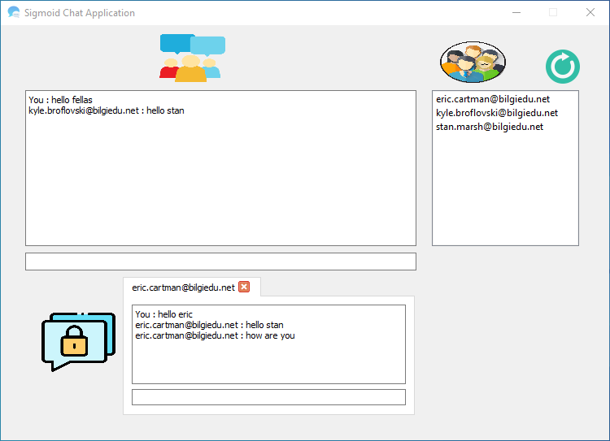
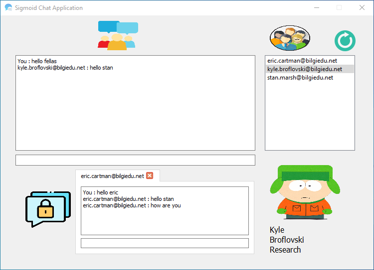

#### Video ####

This is my second assignment of Computer Networks and Network Programming. In this assignment,we have been asked to implement a chat application with multiple clients.Our scenario is that, There is a company , which needs a chat application for their employees internal usage. I will demonstrate chat application, that i made for this company. I name it as Sigmoid Chat Application. Sigmoid is a mathematical function.I love that how it sounds. That's why i name it as Sigmoid.

## Screenshots Of Program

